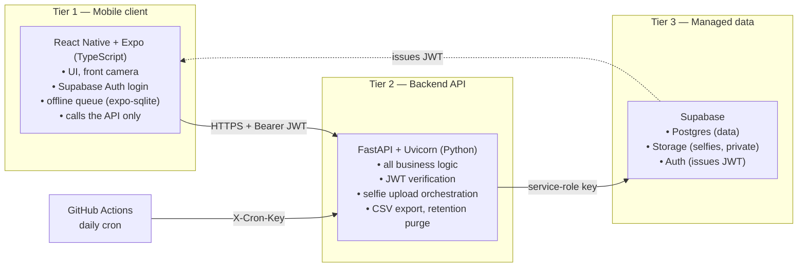

# CAM — Center Attendance Monitoring

A full-stack mobile app for **teachers** to log attendance of teachers and students entering a learning center. Every check-in/out is verified with a **selfie + server timestamp**, works **offline**, and treats student images as sensitive personal data under the Philippine Data Privacy Act (RA 10173).

Built entirely on free tools and free tiers.

> **Status:** v1 complete and deployed. A teacher can log in, pick any person, check them in/out with a required selfie and automatic timestamp, view today's in/out board, filter and export history, and have offline entries sync automatically — with Row-Level Security locking data to teachers and an automated selfie-retention policy in place.

---

## Why this project is interesting (engineering-wise)

Most "attendance app" projects are a single Firebase/Supabase-backed client. CAM is deliberately built as a **true 3-tier system with a real server tier**, because that's the more honest reflection of production architecture and the more defensible set of trade-offs:

- **The client never touches the database or storage directly.** It calls a FastAPI backend, which is the only component that holds the Supabase service-role key. Secrets stay off the device.
- **The server owns business rules** — person validation, the authoritative timestamp, selfie upload orchestration, CSV export, and retention purging all live in one place that can be tested and swapped independently of the UI.
- **The data layer is replaceable.** Supabase is used as managed Postgres + Storage + token issuer. Because the client only knows the API, the database could change without touching the mobile app.

This is a stronger portfolio artifact than a BaaS-only app: it demonstrates auth verification, offline-first sync, a documented retention/privacy policy, and deliberate architectural boundaries.

---

## Architecture



### Auth flow

1. Client signs in with Supabase Auth (`supabase-js`) → receives a JWT access token.
2. Client sends every API request with `Authorization: Bearer <token>`.
3. FastAPI **verifies the JWT against Supabase's JWKS** (ES256), looks up the `teacher_accounts` row, then performs DB/storage work with the service-role key.
4. Row-Level Security stays enabled as defense-in-depth; primary enforcement lives in the API.

### Attendance capture flow

Teacher picks a person → chooses In/Out → captures a front-camera selfie (mandatory) → the app `POST`s a multipart request (person, direction, device time, token, image) → the backend validates, uploads the selfie to Supabase Storage, stamps the **server** timestamp as source of truth, and inserts the `attendance` row. Offline, the request + image are queued in `expo-sqlite` and replayed when connectivity returns.

---

## Key engineering decisions & trade-offs

| Decision | Why | Trade-off accepted |
|---|---|---|
| **FastAPI in front of Supabase** (not BaaS-direct) | Real server tier owns validation and secrets; DB is swappable | More moving parts + a service to host |
| **Server-set timestamp** as source of truth | Device clocks drift and can be offline for hours | Also store device time to detect drift |
| **JWKS/ES256 verification** | Supabase project signs with ES256, not the legacy HS256 shared secret | Slightly more code (kid lookup) than a shared secret |
| **Offline queue in `expo-sqlite`** | Center Wi-Fi is unreliable; no capture should be lost | Sync/replay logic + local selfie cache to manage |
| **Selfie for human verification only** (no face recognition) | Minimizes data sensitivity and scope | No automatic identity matching |
| **90-day retention + scheduled purge** | Minors' images are sensitive; minimize data held (RA 10173) | Long-term reporting keeps only the textual log |
| **Free tier everywhere** | Zero running cost for a single center | Render sleeps ~15 min idle (~30s cold start); 1 GB storage caps selfie volume |

---

## Features (v1)

- Teacher/admin login (email + password via Supabase Auth).
- Roster of people (teachers + students), searchable and filterable; admin add/edit/deactivate.
- Check-in / check-out with a **mandatory selfie** and automatic server timestamp; direction auto-toggles with manual override.
- **Today** board — live who's-in / who's-out, computed on the Manila day boundary.
- **History** with date filtering (Today / Yesterday / 7-day chips, day stepping) and **CSV export** with Manila-local times and the logging teacher's name.
- **Offline-tolerant capture** — entries queue locally and sync automatically on reconnect; local selfies are deleted after upload.
- **Privacy & retention** — private storage bucket (signed URLs only), RLS, daily automated purge of selfies older than the retention window, and full-erase deletion of a person and all their images on request.

---

## Tech stack (free tools only)

| Tier | Choice |
|---|---|
| Client | React Native + Expo (TypeScript), React Navigation, `expo-camera`, `expo-sqlite`, `@react-native-community/netinfo` |
| Backend API | FastAPI + Uvicorn; JWT verification via JWKS |
| Data / Auth / Storage | Supabase free tier (Postgres + Auth + Storage) |
| Hosting (API) | Render free web service (Docker) |
| Scheduled purge | GitHub Actions (daily cron → authenticated API endpoint) |
| CI / VCS | Git + GitHub |

---

## API endpoints (v1)

| Method | Path | Auth | Purpose |
|---|---|---|---|
| GET | `/health` | none | liveness |
| GET | `/people` | teacher | list active people |
| POST | `/people` | admin | add person |
| PATCH | `/people/{id}` | admin | edit person |
| DELETE | `/admin/people/{id}` | admin | full erase (person + attendance + selfies) |
| POST | `/attendance` | teacher | log in/out (multipart: fields + selfie) |
| GET | `/attendance/today` | teacher | today's in/out board |
| GET | `/reports/history` · `/reports/history.csv` | teacher | history JSON / CSV export by date range |
| POST | `/admin/teachers` | admin | provision a new teacher login (email + assigned password); creates Auth user + person + teacher_accounts atomically |
| POST | `/admin/purge-selfies` | admin **or** `X-Cron-Key` | run retention purge |

Interactive OpenAPI docs are served at `/docs`.

---

## Repository layout

```
CAM-Center Attendance Monitoring/
├── app/                       # Tier 1 — Expo React Native client
│   └── src/
│       ├── screens/           # auth, attendance, roster, reports
│       ├── services/          # apiClient + *Api, supabaseClient (auth only), syncQueue
│       ├── hooks/ context/ utils/ constants/ types/
│       └── navigation/
├── backend/
│   ├── api/                   # Tier 2 — FastAPI (all business logic)
│   │   └── app/
│   │       ├── main.py        # app factory, CORS, routers, /health
│   │       ├── core/security.py   # JWKS/JWT verification
│   │       ├── routers/       # people, attendance, reports, admin
│   │       └── services/      # attendance, storage, export, retention
│   └── supabase/
│       └── migrations/0001_init.sql   # schema + RLS
├── .github/workflows/retention-purge.yml
└── docs/                      # spec, data model, decisions, privacy & consent
```

---

## Running locally

**Prerequisites:** a free Supabase project (run `backend/supabase/migrations/0001_init.sql`, create a **private** `selfies` bucket), Python 3.11+, Node, and the Expo Go app on a phone.

1. **Backend** — `cd backend/api`, create a venv, `pip install -r requirements.txt`, copy `.env.example` → `.env` (Supabase URL, service-role key, JWT/JWKS config, `CRON_SECRET`), then `uvicorn app.main:app --reload --host 0.0.0.0 --port 8000`. Verify `http://localhost:8000/docs`. Run `pytest` to check.
2. **Client** — `cd app`, `npm install`, copy `.env.example` → `.env` (Supabase URL + anon key, `EXPO_PUBLIC_API_BASE_URL`), then `npx expo start -c` and scan the QR in Expo Go.

> **Note:** the app is pinned to **Expo SDK 54** to match the installed Expo Go client; installs may need `--legacy-peer-deps`.

### Secret scanning (required before you commit)

This repo blocks commits that contain secrets via a [gitleaks](https://github.com/gitleaks/gitleaks) pre-commit hook. Two independent layers enforce it:

1. **Local hook** (`.githooks/pre-commit`) — scans staged changes on every commit. It is **fail-closed**: if `gitleaks` is not installed, the commit is **blocked**, not skipped. This hook is tracked in-repo but only activates once you point git at it — a fresh clone does not run it until you do:

   ```bash
   git config core.hooksPath .githooks   # one-time, per clone
   brew install gitleaks                 # macOS; the hook refuses to run without it
   ```

   Without the `core.hooksPath` line the hook is silently inactive. Without `gitleaks` installed, commits are blocked until you install it (bypass once with `git commit --no-verify`, not recommended).

2. **CI backstop** (`.github/workflows/gitleaks.yml`) — runs `gitleaks` on every push and PR regardless of anyone's local setup, so a clone that skipped step 1 is still covered server-side. Both layers share the same `.gitleaks.toml` ruleset.

---

## Privacy & compliance

Selfies of students are sensitive personal data. Before any pilot: obtain **written parental/guardian consent** (template in `docs/`), keep the `selfies` bucket private (signed URLs only), enforce RLS, and honor the documented retention policy and deletion requests. See `docs/privacy-and-retention.md` and the project spec (§9) for the full policy under RA 10173.

---

## Roadmap (v2 candidates)

Multi-center / franchise-wide dashboard, parent-facing notifications, and optional facial-recognition assist — all explicitly out of scope for v1.

Also planned for v2: **forced password change on first login** — new teachers are provisioned with an admin-assigned temp password (see `POST /admin/teachers`); v2 should require them to set their own password before full access, plus a self-service password-reset path.
